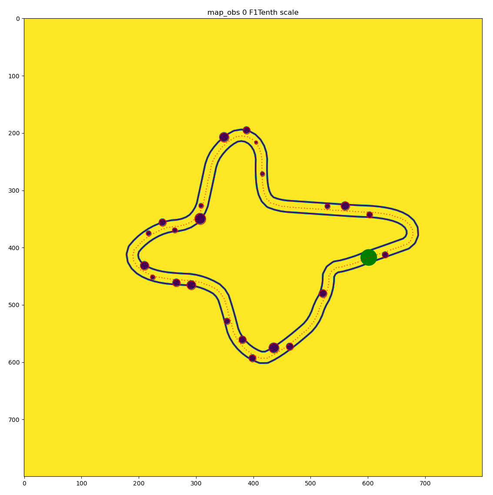

# Randomized Radial-based Track Generation

This repository contains a Python script for generating random race tracks. The tracks are created using a combination of mathematical functions and randomization to provide diverse and interesting layouts for simulation or gaming purposes.

## Features
- Generates random race tracks.
- Supports the addition of obstacles.
- Outputs tracks as images and corresponding YAML files.
- Configurable parameters for track generation

## Example
 
 

The green dot is a 1-meter circle indicating the map's origin.

## Usage
To generate random tracks, run the script with the desired parameters:
```
python random_trackgen.py --seed <seed_value> --num_maps <number_of_maps>
```
- `--seed`: Seed for the random number generator (default: 0).
- `--num_maps`: Number of maps to generate (default: 1).

## Configurable Variables
The following global variables are used in the script to control various aspects of track generation:

- LOAD_F1TENTH_SCALE (default: False): Determines whether to load maps at F1Tenth scale.
- PLOT_FOR_SHOW (default: True): Controls whether to display the generated plots.
- WIDTH (default: 5.0): Half-width of the track.
- CHECKPOINTS (default: 25): Number of checkpoints used to create the track.
- ROUNDNESS (default: 0.1): Affects the smoothness of the track curves.
- TRACK_RADIUS (default: max(CHECKPOINTS*4, 40)): Determines the overall size of the track.
- TRACK_DETAIL_STEP (default: 5): Step size for detailed track points.
- TRACK_TURN_RATE (default: random.uniform(0.05, 0.95)): Controls the rate at which the track turns.
- MAP_IMG_RESOLUTION (default: 0.5): Resolution of the generated map image.
- GENERATE_OBSTACLES (default: True): Enables or disables obstacle generation.
- OBSTACLE_INTERVAL (default: 30): Average distance between obstacles.
- LEAST_GAP_WIDTH (default: 4): Minimum gap width between obstacles and the track boundary.
